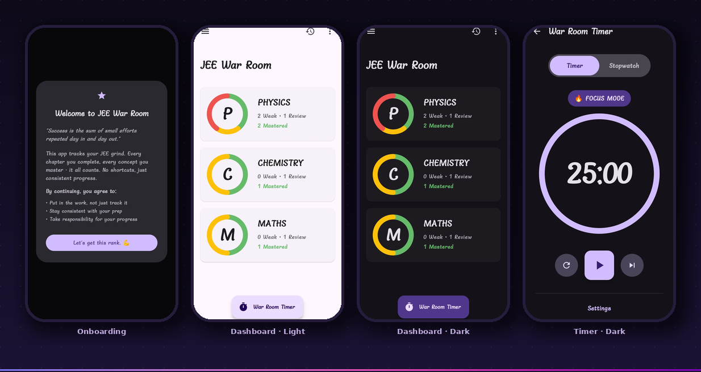

# JEE War Room 🎯

> **Your personal command center for JEE preparation.**
> Track every chapter across Physics, Chemistry, and Maths — from weak spot to mastered — without the noise.

<p align="center">
  
  
  
  
  
</p>

---

## 📱 Overview

JEE War Room is a focused Android study tracker built for one thing: getting you through JEE prep without losing track of where you stand.

Most students juggle 90+ chapters across three subjects and have no clear picture of what needs work versus what's done. This app gives you that picture — a clean dashboard, chapter-level status tracking, and linked PDF notes — all stored locally on your device, no login required.

**Built with the philosophy: No shortcuts. Just consistent progress.**

### Who is this for?

- JEE Main / JEE Advanced aspirants managing chapter-wise revision
- Students who want offline-first study tools with zero setup friction
- Anyone who prefers a simple tracker over cluttered study apps

---

## ✨ Features

### Core Features

- **Subject Dashboard** — Visual progress rings for Physics, Chemistry, and Maths. At a glance, you see exactly how many chapters are Weak, under Review, or Mastered for each subject.
- **Chapter Management** — Add chapters with a single tap, reorder them, and delete with a long-press confirmation to avoid accidental removals.
- **Three-State Status System** — Every chapter lives in one of three states:
  - 🔴 **Weak** — needs serious work
  - 🟡 **Review** — studied but not solid
  - 🟢 **Mastered** — ready, no action needed (Chill mode)
- **Status Progression & Reversal** — Move chapters forward with dedicated action buttons, or revert backward using the refresh icon. Full bidirectional control.
- **PDF Note Attachment** — Link any PDF from your device to a specific chapter for quick one-tap access during revision.
- **Status Filtering** — Filter the chapter list by Weak / Review / Mastered. The list updates instantly with no reload.
- **Persistent Local Storage** — All data is saved to device SharedPreferences via Gson serialization. Your progress survives app restarts.

### Additional Features (V1 Release)

- **Pomodoro Timer** — Early-stage study session timer. Timer data is stored in a local study session database.
- **Study Session History** — Records timer sessions for later review (stopwatch-to-history integration in progress).
- **Light & Dark Mode** — Initial theming support is included and actively being improved.
- **Help & Support Screen** — In-app guidance for new users.
- **First-Time Onboarding** — A Terms & Conditions screen on first launch sets expectations clearly with a motivational message.

---

## 🏗️ Tech Stack

| Layer | Technology |
|---|---|
| **Language** | Kotlin |
| **UI Framework** | Jetpack Compose |
| **Design System** | Material 3 |
| **Architecture** | Single-Activity with Composable Navigation |
| **State Management** | `mutableStateListOf` (Compose reactive state) |
| **Data Persistence** | SharedPreferences + Gson JSON serialization |
| **Build System** | Gradle (Kotlin DSL) |
| **Min SDK** | API 24 (Android 7.0 Nougat) |
| **Target SDK** | Latest stable |

No external APIs. No network calls. No account required.

---

## ⚙️ Installation

### Option 1 — Download the APK (Easiest)

1. Go to the [Releases](https://github.com/pvr0108/JeeWarRoom/releases) page
2. Download the latest `apk` file
3. On your Android device, enable **Install from unknown sources** if prompted
4. Open the APK and install

### Option 2 — Build from Source (Android Studio)

**Prerequisites:** Android Studio Hedgehog or newer, JDK 17+

```bash
# 1. Clone the repository
git clone https://github.com/pyd-07/JeeWarRoom.git

# 2. Open the project
File > Open > Select the cloned folder in Android Studio

# 3. Let Gradle sync automatically

# 4. Connect your device or start an emulator

# 5. Hit Run ▶️
```

No API keys. No `.env` file. No external service setup required.

---

## 📂 Project Structure

```
JeeWarRoom/
├── app/
│   └── src/
│       └── main/
│           ├── java/com/example/jeewarroom/
│           │   └── MainActivity.kt        # Entire app: data models, state, UI
│           ├── AndroidManifest.xml        # App manifest & permissions
│           └── res/                       # Resources (icons, strings, themes)
├── gradle/
│   └── libs.versions.toml                # Centralized dependency versions
├── build.gradle.kts                      # Root-level Gradle config
├── settings.gradle.kts                   # Project settings
└── gradle.properties                     # Gradle JVM flags
```

**Single-file architecture:** All Compose screens, data models, state logic, and navigation live inside `MainActivity.kt`. This is an intentional design choice — the simplicity of the project doesn't warrant a multi-module breakdown. Everything is readable in one place.

---

## 🔄 How It Works

### Data Model

Three enums and one data class drive the whole app:

```kotlin
enum class Subject { PHYSICS, CHEMISTRY, MATHS }
enum class Status  { RED, YELLOW, GREEN }

data class Chapter(
    val id: String,
    val name: String,
    val subject: Subject,
    var status: Status,
    var noteUri: String? = null,
    var order: Int = 0
)
```

`RED` = Weak, `YELLOW` = Review, `GREEN` = Mastered.

### State Flow

```
User Action
    │
    ▼
mutableStateListOf<Chapter>        ← reactive in-memory state
    │
    ├─── triggers Compose recomposition (UI updates instantly)
    │
    └─── persists to SharedPreferences via Gson serialization
             (survives app restarts)
```

When the app launches, it deserializes the saved JSON back into the chapter list. Every mutation writes back immediately — no save button needed.

### Navigation Flow

```
Launch
  │
  ├─ First time? ──► Onboarding / Terms Screen
  │
  └─ Returning ──► Subject Dashboard
                         │
               ┌─────────┼──────────┐
               ▼         ▼          ▼
           Physics    Chemistry    Maths
           (Chapter List with filter, add, status buttons)
                         │
                    PDF Picker (system file chooser)
```

### Status Progression

```
🔴 Weak  ──[Mark for Review]──►  🟡 Review  ──[Mark Completed]──►  🟢 Mastered
   ▲                                 ▲                                   │
   └──────────────[Revert]───────────┴───────────────[Revert]────────────┘
```

### Performance Details

- `LazyColumn` with stable `key` parameters prevents unnecessary recomposition when list items change.
- Filter calculations are memoized (`remember { derivedStateOf { ... } }` pattern) so the chapter list doesn't recompute on every keystroke or scroll.
- Minimal library dependencies mean fast Gradle build times and a small APK footprint.

---

## 📸 Screenshots



> Left to right: First-time onboarding · Dashboard in light mode · Dashboard in dark mode · War Room Timer

---

## 🧪 Usage Guide

### Adding Chapters

1. Open any subject (Physics / Chemistry / Maths)
2. Tap the **`+` FAB** in the bottom-right corner
3. Enter the chapter name and confirm

### Updating Chapter Status

| Current Status | Button | Next Status |
|---|---|---|
| 🔴 Weak | **Mark for Review** | 🟡 Review |
| 🟡 Review | **Mark Completed** | 🟢 Mastered |
| 🟢 Mastered | **✨ Chill** | — (no action needed) |

To revert a chapter, tap the **refresh icon** on any chapter row.

### Attaching PDF Notes

1. Tap the **`+` note icon** next to a chapter name
2. Select a PDF from your device storage
3. The PDF path is saved — tap the file icon anytime to open it

### Deleting Chapters

- **Long-press** any chapter name
- A confirmation dialog appears to prevent accidental deletion
- Confirm to permanently remove the chapter

### Filtering

- Tap **Filter** at the top of any subject's chapter list
- Toggle any combination of 🔴 Weak / 🟡 Review / 🟢 Mastered
- The list updates immediately

### Pomodoro Timer

- Available from the timer/session screen
- Tracks active study sessions and logs them to local session history

---

## 🤝 Contributing

Contributions are welcome. Here's how to get started:

```bash
# Fork the repo, then clone your fork
git clone https://github.com/<your-username>/JeeWarRoom.git
cd JeeWarRoom

# Create a feature branch
git checkout -b feat/your-feature-name

# Make your changes, then commit
git commit -m "feat: describe your change clearly"

# Push and open a Pull Request
git push origin feat/your-feature-name
```

**Ground rules:**
- Keep pull requests focused — one feature or fix per PR
- Respect the single-file architecture unless you have a strong reason to refactor
- The app's strength is its simplicity — avoid adding heavy libraries without discussion
- If you're fixing a bug, include steps to reproduce it in your PR description

For major changes, open an issue first to discuss the idea.

---

## 📄 License

This project is open source and available under the [MIT License](LICENSE).

---


<p align="center">
  <strong>Built by a JEE aspirant, for JEE aspirants.</strong><br/>
  Good luck. Stay consistent. 💪
</p>